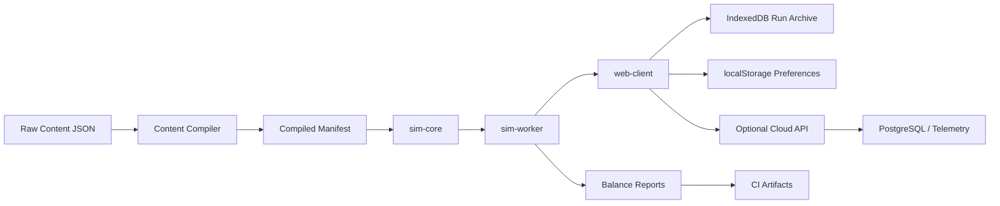
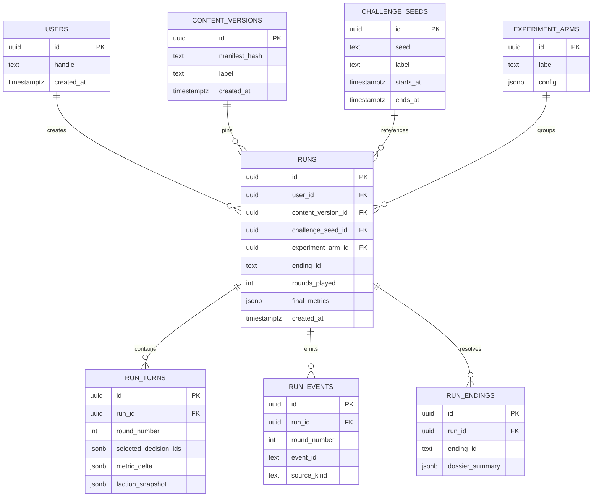

# idea.md - The Master Expansion Document

## Ground Truth Snapshot

This document is intentionally anchored to the code and documentation currently in the repository, not to a hypothetical future version of the game.

The current build is a browser-native, deterministic, local-first macro-management simulation with a very clean separation between authored content and runtime rules. The runtime stack is `React 18.3.1`, `TypeScript 5.8.3`, `Vite 6`, `Zustand 5`, `Zod 3`, `Framer Motion 11`, `Vitest`, and `Playwright`. The product loop is simple and legible: `BoardPacket` -> decision selection -> `resolveRound` -> deterministic operating drift -> due delayed events -> one weighted ambient event -> ending check -> persisted local state update.

The active game state is a compact vector of `13` metrics: `airlineCash`, `personalWealth`, `debt`, `assetValue`, `workforceSize`, `workforceMorale`, `marketConfidence`, `creditorPatience`, `legalHeat`, `safetyIntegrity`, `publicAnger`, `stockPrice`, and `offshoreReadiness`. That state is extended with flags, pending delayed events, event counts, a bounded history log, and current selection state. The simulation currently gains most of its expressive power from authored decisions and authored events rather than from autonomous world simulation. That is important: the codebase is already strong at editorial control, deterministic testing, and maintainability, but it is still light on deep systemic emergence.

The authored content surface is already significant for a single-player browser sim. Validation currently reports `100` decisions across `10` decision packs, `132` events split into `62` ambient and `70` delayed events, and `5` endings. The content organization is stronger than the runtime complexity. `content/decisions/` and `content/events/` are already doing the heavy lifting for replay variety, while the simulation core remains intentionally compact. This is a good starting point for a major expansion because it means the game already has a strong editorial voice and a healthy data-driven authoring model.

The current deterministic curation and simulation pipeline also expose the next real risks. The seeded report run with `200` campaigns and max `24` rounds produced `100%` extraction endings, `21%` surfaced decision coverage, and `8.3%` triggered event coverage. That is not a small balancing quirk. That is a strong structural signal that the current decision utility model and content activation model are converging into a narrow corridor. In other words, the code is stable, but the possibility space is not yet wide enough. The next era of the project is not about fixing chaos. It is about introducing enough structured complexity that the game stops collapsing into one obvious dominant play pattern.

The quality baseline is otherwise healthy. Current local verification passed content validation, the unit and component suite passed `32/32` tests, `lint` and `typecheck` completed cleanly, and the production build emitted a roughly `493.67 kB` JavaScript bundle, `14.55 kB` CSS bundle, and `0.56 kB` HTML shell before gzip accounting. The content validator also surfaced a few strategically important loose ends rather than hard failures: one unreferenced delayed event (`customs_broker_ping`) and several flags that are set but never consumed (`consentOrderLive`, `reformOfficeLive`, `scapegoatUsed`, and `suitorWhispers`). Those warnings are not repository hygiene trivia. They are clues about latent design branches that the next expansion should either activate or remove.

The rest of this document assumes that the current architecture is worth preserving in spirit but not freezing in place. The goal is not to discard the local-first deterministic identity. The goal is to evolve it into a deeper simulation platform that can support richer operational systems, autonomous pressures, broader content reachability, stronger balancing tools, and future multi-developer collaboration without losing the clarity that makes the current build so maintainable.

## Phase 1: The Virtual Council

### Agent Alpha - The Algorithms and Engine Lead

The current engine is not computationally stressed. That is the first truth. `getAvailableDecisions` operates over the full decision library every round, filtering eligible entries, shuffling deterministically, assigning fixed heuristic scores, and then sorting the main pool. With only `100` decisions, the effective cost is trivial: roughly \(O(D \log D)\) per round with very small constants. `resolveRound` is similarly cheap. Metrics are a flat numeric vector, impacts are simple additive deltas with clamping, delayed events are a small array, ambient selection is a filtered weighted pick, and the history rail is capped. Rendering is equally light: a metric rail, a board packet, a short decision tray, and at most `10` visible history entries. From a raw performance standpoint, the project is still in a prototyping comfort zone.

The real issue is not that the game is slow. The issue is that the current engine shape will not scale gracefully once the simulation starts modeling more than authored card consequences. The present operating drift in `src/simulation/resolution/resolveRound.ts` is a single weighted formula that compresses the quarter into one linear-ish balance equation. That works for the current macro tone, but it has no internal topology. There is no route network, no fleet graph, no faction memory graph, no causal lag model beyond delayed event references, and no operational substrate that can produce emergent cross-system behavior. The result is legible but shallow. The game currently has authored pressure, not systemic pressure. It feels sharp because the writing is sharp, not because the world is dynamically recomputing strategic consequence.

I also see two specific algorithmic stress points that are still cheap today but will become brittle as the game expands. First, delayed event resolution currently scans pending events and then linearly searches the delayed event list for each pending id. That is perfectly fine at `70` delayed events, but it is the wrong asymptotic shape once you introduce large consequence calendars, faction-authored incidents, or route-level breakdown events. Second, the decision tray is driven by a fixed score policy that uses hand-tuned bonuses and penalties. That is a strong short-term heuristic, but it is not a robust search procedure. It is already revealing its limits through the seeded balance report. If the tray scorer converges on a single dominant extraction corridor now, it will become an even stronger failure mode once additional content and sub-systems are layered on top.

There is also a hidden structural absence worth calling out directly: the project has no physical simulation in the classical game-engine sense. There is no rigid-body physics, no collision system, no spatial partitioning, and no pathfinding because the current game does not yet simulate a physical world. That is not a flaw in itself. It is a design decision. But it means that when this game eventually expands into network operations, weather, maintenance cascades, airport congestion, or crew displacement, we will not be incrementally tuning an existing spatial engine. We will be introducing spatial and graph-based reasoning almost from zero. That is an opportunity. We can design the future operational layer deliberately around graph algorithms, sparse propagation, and schedulable causal events instead of retrofitting a physics engine that the product never needed.

My radical recommendation is to treat the current engine as the deterministic shell around a future simulation kernel. That kernel should add five things in order: a constraint-aware tray composer, a sparse causal influence graph, a priority-queue event scheduler, a state-space reachability explorer for balance and coverage analysis, and a route-network disruption solver for the first truly emergent operational layer. If those five algorithms land cleanly, this project stops being merely a tightly written card sim and becomes a simulation platform capable of supporting procedurally generated crises, autonomous counterparties, and a much wider strategic surface without losing determinism.

### Agent Beta - The Architecture and Stack Lead

The architectural baseline is better than most early-stage game prototypes. The repository already respects meaningful boundaries: `src/simulation/` isolates deterministic rules from React, `content/` holds validated authored data, `src/components/` and `src/screens/` contain presentation concerns, `src/lib/storage/` wraps persistence, and the PRD layers clearly differentiate stable product intent from iteration packets. This is exactly the kind of repo that can survive long breaks and future parallel work because the documents and file structure agree with each other. The current `V0.4` direction also already shows architectural maturity: versioned saves, schema validation, content diagnostics, seeded simulation tooling, and decomposed systems.

Where the architecture starts to strain is not in correctness but in scaling model boundaries. The simulation core is still packaged as source files inside the same browser app rather than as an explicit domain package. Content loading is cached and validated at runtime, but there is no content compilation stage that emits indexed manifests, event lookup maps, balance metadata, or precomputed pack statistics. The decision and event registries are still manually imported file lists, which is acceptable at the current size but noisy at scale. The persistence model is still `localStorage`, which is correct for the current product phase, but it will become insufficient once the game supports longer run histories, turn replays, balance analytics, scenario archives, or player-generated challenge seeds.

The future stack should therefore stay local-first in gameplay, but become package-first in architecture. I would split the repository into explicit modules: a `sim-core` package containing pure deterministic state transitions and domain types, a `content-schema` package containing Zod schemas plus authoring validation utilities, a `content-compiler` package that turns raw JSON into a compiled manifest and diagnostic report, a `web-client` app that handles rendering and local UX, and a `sim-worker` boundary so large Monte Carlo reports and future autonomous faction planners never block React. For persistence, I would keep `localStorage` only for tiny preference state and migrate run archives, replays, diagnostics, and future scenario caches into `IndexedDB` through `Dexie`. For remote services, I would not make the core sim server-dependent, but I would add an optional cloud layer for telemetry, experiment tracking, and content distribution using `Hono` or a thin `Cloudflare Workers` service with `PostgreSQL` on `Neon` and `Drizzle ORM`.

The toolchain should scale with that modularization. `pnpm` plus `Turborepo` would be a better long-term fit than a single-package layout once there are worker targets, content compiler targets, CI balance jobs, and potentially editor tooling for content authors. `Vitest` should remain the fast unit harness for deterministic core testing. `Playwright` should expand into true run-journey verification and regression snapshots. `Storybook` or `Ladle` would become valuable once the UI starts hosting denser systems like network maps, faction panels, dossier views, and run replay inspectors. On the CI/CD side, the repo is ready for a real GitHub Actions graph: lint, typecheck, deterministic content validation, unit tests, seeded balance tests with thresholds, production build, Playwright smoke, preview deploy, and nightly long-run simulations that publish artifacts rather than just pass or fail.

My radical idea is to treat authored content as compiled game assets, not just runtime JSON. That means raw decision and event JSON stay human-editable, but the build system emits a generated manifest with id maps, tag indexes, flag producers and consumers, requirement reachability hints, pack dependency graphs, and hash-stamped content versions. Once that exists, every downstream system gets simpler. The runtime stops doing repeated scans it no longer needs to do. Diagnostics become richer. Save payloads can pin a content version. Long-run balance reports become reproducible against explicit manifests. And multi-developer scaling improves because the content pipeline itself becomes a shared contract rather than a loose convention.

### Agent Gamma - The Gameplay Visionary

The existing game loop already has a powerful hook: the split between personal victory and corporate survival is legible, nasty, and original. The player is not building an airline. The player is arbitraging time, deniability, liquidity, and institutional credibility. The board packet, metric rail, decision tray, and consequence feed all reinforce that core lens. This is not a game looking for an identity. It already has one. What it lacks is the second and third layer of consequence that make repeated runs feel like they are exploring a living possibility space rather than a finely written but still fairly linear decision gauntlet.

The strongest evidence of that limitation is the seeded report. If `200` deterministic campaigns all resolve into extraction, the game is telling us something uncomfortable: the current metric topology, ending thresholds, and tray scoring are rewarding one dominant interpretation of the fantasy. That is actually useful. It means the fantasy is strong enough to point in a direction. But it also means the mid-game is not yet full of enough competing incentives, faction reactions, or opportunity costs to pull the player into genuinely different strategic identities. The player needs to feel the tension between at least several viable executive archetypes: the merger groomer, the offshore operator, the denial machine, the restructuring cannibal, the regulatory theater specialist, the scorched-earth creditor fighter, and the reluctant stabilizer who only later discovers the temptation to defect.

The current game also lacks durable world memory. History entries exist, but they are presentation artifacts, not strategic actors. Flags exist, but they are mostly yes-no unlocks, not living relationships. Delayed events create consequence, but they do not yet create institutions with memory. That means the world answers back, but it does not yet scheme back. The next leap in gameplay should be to introduce medium-horizon systems that remember how the player has been winning. Creditors should not just lose patience; they should learn what style of deception they are seeing. Regulators should not just appear at heat thresholds; they should accumulate dossiers. Labor should not just lower morale; it should form a counter-strategy. The board should not just be flavor; it should periodically decide whether the player is still the optimal villain.

I want three massive expansions. First, a dynamic factional political economy where board members, creditors, labor, regulators, media, and political actors have independent states and agenda conflicts. Second, an operational world layer where weather, maintenance backlog, route quality, and network contraction create emergent operational crises that the executive is trying to hide or monetize. Third, a procedural scandal and legacy machine that turns runs into stories with dossiers, witness chains, committee calendars, immunity deals, leaked decks, and post-run reputational aftermath. If these three systems land, player retention no longer depends on raw card count. It depends on discovering new forms of executive behavior and watching the world react in distinct, memorable ways.

Retention strategy should also evolve beyond simple replayability. The current loop is ideal for scenario seeds, weekly challenge packets, named executive archetypes, unlockable doctrines, and post-run analytics. A player who loses should still receive a rich postmortem: which faction broke first, which scandal chain actually doomed them, which assets they over-monetized, and which exit window they missed by one or two rounds. A player who wins should unlock new ceilings and more dangerous variants, not just replay the same path. The goal is not to pad the product with meta noise. The goal is to build a system that makes each run feel like an authored scandal produced by interacting machinery rather than a solved route through a familiar deck.

### Agent Delta - The AI and NPC Logic Expert

Right now, the game has almost no true agentic behavior. That is not criticism. It is a precise statement about the current abstraction layer. Entities like creditors, labor, regulators, and the board are represented indirectly through metrics, flags, authored events, and ending checks. They influence the world, but they do not independently reason about it. There is no belief state, no world model per faction, no planning horizon, and no opponent adaptation. The world is reactive, not strategic. That design is clean and readable, but it leaves enormous room for the game to feel more alive without abandoning determinism.

The cleanest evolution path is not to jump straight into black-box machine learning. It is to formalize faction AI as authored, deterministic planners. A hybrid model would work best. At the top level, each major faction gets a goal stack and a pressure profile. Regulators want visible corrective action, defensible enforcement optics, and eventually personal accountability. Labor wants survival, public sympathy, wage preservation, and retaliatory leverage. Creditors want recoverability and honest collateral value. The board wants deniability, solvency theater, and a plausible successor. These goals can be expressed through Goal-Oriented Action Planning, utility curves, or lightweight behavior trees that operate over the same metric vector the simulation already uses. That gives the world agenda without making the simulation opaque.

The key is to introduce an AI blackboard, not an AI spectacle. The blackboard would collect the shared world state, including metrics, flags, content versions, unresolved dossiers, recent decisions, and faction-specific memory. Each faction planner then reads from that blackboard and proposes intents: leak, pressure, negotiate, threaten, delay, cooperate, defect, testify, refinance, or replace leadership. Those intents do not need to turn into freeform natural-language outputs. They can simply become weighted event candidates, crisis escalations, decision locks, negotiation windows, or forced board packet topics. In that model, the game remains content-authored and testable, but the order, timing, and pressure of consequences become more emergent.

Machine learning should enter only where it offers leverage without corrupting determinism. The right uses are offline and tooling-oriented. Use telemetry or scripted simulations to detect dominant strategies. Use clustering to discover which runs are effectively the same despite cosmetic variation. Use sequence mining to identify decision chains that overproduce extraction or underproduce legal catastrophe. Use procedural text variation models only as offline content assistants whose outputs are reviewed and compiled back into deterministic assets. Do not put a runtime LLM in the turn loop. That would make balancing, testing, and authored tone much harder while adding the wrong kind of unpredictability.

My radical proposal is to make the factions feel alive through deterministic adversarial planning rather than through stochastic noise. If the player repeatedly abuses labor, labor should escalate from morale loss to organized strategy. If the player repeatedly hides behind regulatory theater, regulators should adapt by demanding structurally different concessions. If the player cultivates merger optics too aggressively, the board should start preparing a scapegoat protocol. That kind of world feels intelligent because it responds to the style of the player's misconduct, not just to the magnitude of a few metrics. When that happens, the game stops feeling like a set of consequences and starts feeling like an ecosystem of enemies, allies, and temporary co-conspirators.

## Phase 2: Synthesis and the idea.md Report

### Section 1: Algorithmic Frontiers

The current runtime is deterministic, stable, and easy to inspect. That is valuable. We should protect it. But if the game is going to scale in systemic depth, content reachability, and long-run replay value, the next expansion must be algorithmic. The following five algorithms are the minimum viable frontier for turning this project from a sharp authored sim into a deep simulation platform.

#### 1. Constraint-Aware, Diversity-Preserving Tray Composition

The current tray curation model in `src/simulation/systems/decisionEngine.ts` is a deterministic heuristic ranker with explicit pack diversity and group-duplication constraints. That is a good first-generation system. It already does better than naive random choice because it preserves readability and strategic contrast. The problem is that it still scores cards independently and then layers constraints afterward. That approach breaks down once the design problem becomes "choose the best set of cards that together create tension, coverage, and future consequences" rather than "rank each card by local usefulness." The seeded report strongly suggests the current scorer is guiding the system toward a narrow, extraction-favoring equilibrium.

The next tray composer should be expressed as a constrained set optimization problem. Instead of scoring decisions independently and then greedily selecting them, define a set objective over the entire tray:

\( F(T \mid s) = \sum_{d \in T} U(d \mid s) + \lambda \cdot D(T) + \mu \cdot C(T \mid s) - \nu \cdot R(T, T_{t-1}) \)

Where:

- \(U(d \mid s)\) is the state-conditioned utility of a single decision.
- \(D(T)\) rewards pack, group, and tactic diversity across the set.
- \(C(T \mid s)\) rewards chain completion or chain surfacing when a playbook is live.
- \(R(T, T_{t-1})\) penalizes redundancy against the previous tray and against recently overrepresented packs.

This formulation matters because it stops thinking in terms of "best card, then next-best card" and starts thinking in terms of "best tray for the current quarter." Once the tray is the optimization target, we can intentionally ensure that one card offers relief, one card offers temptation, one card extends a live playbook, one card opens a new tactical lane, and one card signals danger.

The implementation does not need a brute-force search over all subsets. With a tray size of `5`, a beam search or greedy submodular approximation is enough and stays deterministic. The runtime flow can remain almost identical to the current system:

```ts
type TrayContext = {
  run: RunState;
  previousTrayIds: Set<string>;
  recentPackPressure: Map<DecisionPackId, number>;
  livePlaybooks: Set<string>;
};

function scoreTrayCandidate(
  chosen: DecisionDefinition[],
  candidate: DecisionDefinition,
  context: TrayContext,
): number {
  const utility = scoreDecisionUtility(candidate, context.run);
  const diversity = scoreMarginalDiversity(chosen, candidate);
  const chainUrgency = scoreChainUrgency(candidate, context.livePlaybooks);
  const noveltyPenalty = scoreRepeatPenalty(candidate, context.previousTrayIds);

  return utility + diversity + chainUrgency - noveltyPenalty;
}

function composeTray(
  pool: DecisionDefinition[],
  context: TrayContext,
  traySize: number,
): DecisionDefinition[] {
  const beam: DecisionDefinition[][] = [[]];

  for (let step = 0; step < traySize; step += 1) {
    const nextBeam: Array<{ tray: DecisionDefinition[]; score: number }> = [];

    for (const partial of beam) {
      for (const candidate of pool) {
        if (partial.some((entry) => entry.id === candidate.id)) {
          continue;
        }

        if (!passesHardConstraints(partial, candidate, context)) {
          continue;
        }

        const tray = [...partial, candidate];
        const score =
          scoreCompleteTray(tray, context) +
          scoreTrayCandidate(partial, candidate, context);

        nextBeam.push({ tray, score });
      }
    }

    beam.splice(
      0,
      beam.length,
      ...nextBeam
        .sort((a, b) => b.score - a.score)
        .slice(0, 24)
        .map((entry) => entry.tray),
    );
  }

  return beam[0] ?? [];
}
```

Integration is straightforward. The current `getAvailableDecisions` already computes eligibility, previous-round suppression, seeded ordering, and pack/group constraints. The new composer should preserve those hard constraints but replace the independent sort and repeated linear `pickCandidate` scans. The best entry point is to retain `isDecisionEligible` and split the current `scoreDecision` into smaller state-aware utility functions. The caller surface can remain the same, which reduces UI churn and test disruption.

Edge cases matter. The algorithm must gracefully degrade when the eligible pool is too small to satisfy diversity targets. It must never starve exit cards when endings are legitimately live. It must not over-reward follow-up cards so strongly that every tray feels pre-scripted. It also needs anti-snowball logic: if a playbook is already dominating the current run, the composer should expose counter-pressure rather than merely accelerating the same winning line. From a performance standpoint, this is still small. Even with several hundred decisions, a deterministic beam search over a bounded tray size remains cheap enough for browser runtime, especially if eligibility filtering and per-card utility primitives are pre-indexed.

#### 2. Sparse Causal Influence Graph for Systemic Drift

The current operating drift function in `resolveRound.ts` is a weighted scalar formula. It is elegant for a first version, but it compresses all economic, labor, legal, and market dynamics into one expression. That makes it readable, but it also means the world has almost no topology. If the game is going to support stronger interactions between safety, public anger, labor, creditors, market narrative, regulatory attention, and future route-level systems, the drift model needs to become a causal graph rather than a single equation.

The proposed model is a sparse influence graph where nodes represent state variables and edges represent directional elasticity, lag, and saturation. The base update for quarter \(t\) can be written as:

\( x_{t+1} = clamp(x_t + u_t + A \cdot x_t + B \cdot h_t + n_t) \)

Where:

- \(x_t\) is the current state vector.
- \(u_t\) is the direct impact vector from selected decisions and resolved events.
- \(A\) is a sparse adjacency matrix encoding endogenous drift between metrics.
- \(h_t\) is a short history feature vector, such as recent layoffs, recent safety deferrals, or repeated deception patterns.
- \(n_t\) is deterministic or seeded noise kept intentionally small.

The crucial advantage is that this creates traceable propagation. A maintenance deferral does not simply decrease `safetyIntegrity`. It can also, with lag and threshold logic, increase regulatory scrutiny, raise future public anger sensitivity, and lower the credibility of later "reform" decisions. A wave of labor cuts can reduce `workforceMorale`, which increases operational fragility, which increases service failures, which increases public anger, which then feeds back into market and legal systems. The world stops being a list of independent meters and starts behaving like a network.

The data model can stay declarative:

```ts
type StateNodeId =
  | MetricKey
  | "boardTrust"
  | "creditorAggression"
  | "regulatoryFocus"
  | "laborMilitancy"
  | "pressIntensity";

interface InfluenceEdge {
  from: StateNodeId;
  to: StateNodeId;
  elasticity: number;
  lag: number;
  minActivation?: number;
  maxActivation?: number;
  tags?: string[];
}

interface DriftContext {
  current: StateVector;
  historyFeatures: Record<string, number>;
  activeFlags: Set<string>;
}
```

The update pipeline can then compute only activated edges, keeping the matrix sparse and interpretable:

```ts
function propagateInfluence(
  graph: InfluenceEdge[],
  context: DriftContext,
): Partial<Record<StateNodeId, number>> {
  const deltas: Partial<Record<StateNodeId, number>> = {};

  for (const edge of graph) {
    const source = context.current[edge.from] ?? 0;
    if (edge.minActivation !== undefined && source < edge.minActivation) {
      continue;
    }
    if (edge.maxActivation !== undefined && source > edge.maxActivation) {
      continue;
    }

    const contribution = source * edge.elasticity;
    deltas[edge.to] = (deltas[edge.to] ?? 0) + contribution;
  }

  return deltas;
}
```

This should not be introduced as an all-at-once rewrite. The first migration step is to re-express the existing operating drift weights as graph edges so the output stays close to current behavior. Only then should new hidden state nodes such as `regulatoryFocus` or `boardTrust` be added. The important edge case is runaway positive feedback. Any influence graph can explode if loops are not damped. Use clamping, saturating nonlinear transforms, and per-turn propagation caps. From a performance standpoint, a sparse edge list over a few dozen nodes is tiny. The value is not speed. The value is expressive structure.

#### 3. Priority-Queue Event Scheduler with Hazard Functions

The current delayed event model is list-based. Decisions push delayed refs into `pendingEvents` with a trigger round, and the resolver scans the list each turn. That is acceptable today, but once the game supports faction-generated incidents, route-specific breakdowns, hearing calendars, subpoena clocks, weather spillovers, and multi-step scandal arcs, event timing must become a real subsystem. The correct abstraction is an event scheduler, not just a list of delayed refs.

The scheduler should combine two ideas. First, a min-heap keyed by trigger time for all guaranteed scheduled consequences. Second, hazard functions for families of contingent ambient or reactive events. Guaranteed consequences are things like "committee hearing in 2 quarters" or "lease reserve true-up on quarter 6." Hazard events are things like "public backlash becomes likely when morale is low, press intensity is high, and a scandal dossier is active." That hybrid lets us keep authored determinism where it matters while opening the door to more systemic emergence.

The core data structure should look like this:

```ts
interface ScheduledEvent {
  id: string;
  kind: "guaranteed" | "hazard";
  eventId: string;
  triggerRound: number;
  priority: number;
  staleAfterRound?: number;
  sourceRefs: string[];
}

interface HazardRule {
  eventId: string;
  baseWeight: number;
  weight: (run: RunState) => number;
  cooldownRounds: number;
}
```

Resolution then becomes:

```ts
function resolveScheduler(
  scheduler: EventScheduler,
  run: RunState,
): ResolvedEventBatch {
  const due = scheduler.popDue(run.round);
  const emitted: EventDefinition[] = [];

  for (const scheduled of due) {
    const event = scheduler.eventById.get(scheduled.eventId);
    if (!event) {
      continue;
    }
    if (!meetsRequirements(event.requirements, run)) {
      continue;
    }
    emitted.push(event);
  }

  const hazardCandidates = scheduler.hazardRules
    .map((rule) => ({
      rule,
      weight: Math.max(0, rule.weight(run)),
    }))
    .filter((entry) => entry.weight > 0);

  const pickedHazard = pickWeighted(
    hazardCandidates,
    (entry) => entry.weight,
    deriveRoundSeed(run),
  );

  if (pickedHazard) {
    emitted.push(scheduler.eventById.get(pickedHazard.rule.eventId)!);
    scheduler.applyCooldown(pickedHazard.rule, run.round);
  }

  return { emitted, scheduler };
}
```

This integrates into the existing resolver cleanly. `pendingEvents` can be replaced by a scheduler snapshot inside run state, or the current array can be version-migrated into a heap-backed representation behind a stable interface. The current linear `delayedEvents.find` lookup should definitely become a map regardless of whether the full scheduler lands immediately. The major edge cases are starvation, stale events, and causal overload. If hazard rules always outcompete guaranteed follow-through, authored playbooks feel fake. If too many events fire in one quarter, the board packet becomes unreadable. Solve this by adding per-turn event budgets and priority tiers: one major event, one minor ambient note, unlimited internal hidden updates.

#### 4. Reachability Explorer and Balance Search

The most important tooling gap revealed by the current diagnostics is not unit correctness. The tests pass. The problem is global reachability and dominance structure. A game with `100` decisions and `132` events should not surface only `21` decisions and `11` events under a standard policy unless those unseen branches are intentionally niche. Right now the project has a deterministic simulation report, which is excellent. The next step is to turn that report into a real state-space explorer that can answer four hard questions: which content is unreachable, which endings dominate, which states are dead zones, and which decision chains create path lock-in too early.

This algorithm should not be a brute-force exhaustive search because the state space will explode as systems deepen. A beam search over state abstractions plus Monte Carlo rollouts is a better fit. The explorer operates over canonicalized state buckets rather than full raw states, tracks unique content reachability, and records transition statistics. The objective is not to produce a perfect solver. The objective is to expose design blind spots early enough that authors and engineers can react.

```ts
interface SearchNode {
  run: RunState;
  depth: number;
  score: number;
  surfacedDecisionIds: Set<string>;
  triggeredEventIds: Set<string>;
}

function exploreReachability(
  initial: RunState,
  width: number,
  depthLimit: number,
): ReachabilityReport {
  let frontier: SearchNode[] = [
    {
      run: initial,
      depth: 0,
      score: 0,
      surfacedDecisionIds: new Set(),
      triggeredEventIds: new Set(),
    },
  ];

  const visited = new Map<string, number>();

  for (let depth = 0; depth < depthLimit; depth += 1) {
    const next: SearchNode[] = [];

    for (const node of frontier) {
      const tray = getAvailableDecisions(loadContent().decisions, node.run);

      for (const choice of generateChoiceCombos(tray, 2)) {
        const nextRun = resolveRound({
          ...node.run,
          selectedDecisionIds: choice.map((entry) => entry.id),
        });

        const key = abstractState(nextRun);
        const novelty =
          countNovelty(node.surfacedDecisionIds, tray) +
          countEventNovelty(node.triggeredEventIds, nextRun.eventCounts);

        const score =
          node.score +
          novelty +
          diversityBonus(choice) +
          endingVarietyBonus(nextRun.endingId);

        if ((visited.get(key) ?? -Infinity) >= score) {
          continue;
        }

        visited.set(key, score);
        next.push(buildSearchNode(node, nextRun, tray, score));
      }
    }

    frontier = next.sort((a, b) => b.score - a.score).slice(0, width);
  }

  return summarizeReachability(frontier, visited);
}
```

This should live beside `scripts/simulate-runs.ts` and eventually power CI gates. Example gates are concrete and useful: no ending should exceed `60%` under the default bot set, at least `55%` of decisions should be surfaced across the nightly scenario matrix, at least `35%` of delayed events should trigger in aggregate across scripted archetypes, and no major pack should have zero reachability under more than one archetype. The edge case is false negatives caused by narrow search width. That is acceptable as long as the explorer reports confidence and coverage metrics rather than pretending to be exhaustive.

#### 5. Route-Network Disruption Solver

This algorithm is future-facing, but it is the algorithmic hinge that unlocks the most dramatic expansion in gameplay. If the game introduces route networks, hubs, fleet allocation, maintenance backlog, crew displacement, and weather shocks, the simulation needs an actual operational substrate. The right abstraction is a graph of airports, route edges, fleets, crew pools, and maintenance resources. The player still acts at the executive level, but their decisions now deform the network, and the network produces downstream crisis packets.

At minimum, the network model needs:

- A weighted graph of hubs and spokes.
- Capacity, demand, and fragility values per route.
- Fleet-type availability and maintenance burden.
- Crew availability by region or labor group.
- Weather and disruption overlays by node and edge.

The core scheduling and stress-resolution step can be modeled with min-cost flow or a simplified constrained assignment solver:

\( \min \sum_{e \in E} c_e \cdot f_e + \sum_{r \in R} p_r \cdot unmet_r \)

Subject to:

- route flow cannot exceed available fleet and crew capacity
- hubs have slot and gate limits
- maintenance backlog increases route failure probability
- weather reduces edge capacity or temporarily removes nodes

This does not mean the player becomes an operations clerk. The executive decisions still operate one level up. A labor cut may remove regional crew slack. A maintenance deferral may raise failure hazard on old-fleet routes. A hub closure may improve cash but reduce network resilience. The solver simply converts those macro decisions into operational truth, which can then flow back into existing metrics like `marketConfidence`, `publicAnger`, `safetyIntegrity`, `legalHeat`, and `creditorPatience`.

The pseudocode shape is clear:

```ts
interface RouteNode {
  id: string;
  slotCapacity: number;
  weatherSeverity: number;
}

interface RouteEdge {
  id: string;
  from: string;
  to: string;
  demand: number;
  fragility: number;
  aircraftRequired: number;
  crewRequired: number;
}

function resolveNetworkQuarter(state: NetworkState): NetworkQuarterResult {
  const effectiveEdges = applyWeatherAndMaintenance(state.edges, state);
  const assignment = solveMinCostFlow(
    state.nodes,
    effectiveEdges,
    state.availableAircraft,
    state.availableCrews,
  );

  return deriveQuarterConsequences(assignment, state);
}
```

The performance risk is manageable because the first version does not need to simulate a real airline map. A curated network of `8` to `20` strategic nodes is enough to create rich executive-level consequences. If the map later grows visually, spatial indexing through a quadtree or R-tree becomes useful for weather overlays, proximity queries, and map rendering. Until then, the important thing is the graph, not the map.

### Section 2: Technical Stack Evolution

The current stack is correct for the current product phase. The browser app is fast to run, deterministic to test, and easy to re-enter. The roadmap below is therefore not a rejection of the current stack. It is a staged evolution that keeps the current strengths while creating the structural room needed for deeper systems, multi-developer scaling, and optional online services.

#### 2.1 Guiding Principles

The stack evolution should follow six hard rules:

- The simulation core remains deterministic and pure by default.
- The product remains playable offline and local-first.
- UI state and simulation state are separated more explicitly over time, not less.
- Content authoring stays human-readable, but compiled manifests become the runtime truth.
- Heavy simulation, long-run analysis, and faction planning move off the main thread.
- Optional online services enrich the product but never become required to run the core game.

#### 2.2 Target Repository Shape

The repository should evolve from a single-app layout into a workspace with explicit package boundaries:

```text
apps/
  web/
    src/
    public/
packages/
  sim-core/
    src/
      state/
      systems/
      scheduler/
      factions/
      network/
  content-schema/
    src/
  content-compiler/
    src/
  ui-kit/
    src/
  analytics/
    src/
workers/
  sim-worker/
    src/
content/
  decisions/
  events/
  endings/
  scenarios/
scripts/
docs/
```

This split is not cosmetic. It creates contractual ownership boundaries. `sim-core` becomes the only place allowed to mutate game state. `content-schema` becomes the authoritative validation layer. `content-compiler` becomes the only place allowed to turn raw authored files into runtime manifests. `apps/web` becomes a consumer, not the owner, of game rules. Once this boundary is real, CI becomes cleaner, save migrations become safer, and future contributors have less room to accidentally blur concerns.

#### 2.3 Recommended Library and Platform Stack

The stack I recommend for the next phase is:

- Package manager and workspace: `pnpm` workspaces with `Turborepo`.
- Web client: `React` and `Vite` retained, upgraded deliberately rather than reactively.
- UI state: `Zustand` retained for thin app state and view preferences.
- Simulation execution: `Comlink` over a dedicated Web Worker.
- Persistence: `Dexie` over `IndexedDB` for run archives, replays, and diagnostics.
- Schemas and authoring contracts: `Zod` retained.
- Server edge layer, optional: `Hono` on `Cloudflare Workers`.
- Database, optional online layer: `PostgreSQL` on `Neon`, accessed with `Drizzle ORM`.
- CI/CD: `GitHub Actions` with preview deploys to `Cloudflare Pages` or `Vercel`.
- UI isolation: `Storybook` or `Ladle` once new system panels begin landing.

I would not switch away from React right now. The app is not constrained by React. I would not replace Zustand with a heavy state machine framework at the application shell either. The real issue is that the simulation kernel is still living inside the browser app package. Fix that first. Similarly, I would not add a backend just to feel "production-grade." Add online services only for clear needs such as telemetry, challenge seeds, content delivery, or social surfaces.

#### 2.4 Target Runtime Architecture



In this architecture, authored content is compiled before runtime. The worker owns expensive deterministic computation. The browser app owns presentation, short-lived interaction state, and user ergonomics. Local persistence is split by payload type: tiny preference state stays cheap in `localStorage`, while larger archives and replay data move to `IndexedDB`. Optional cloud APIs are downstream of the local experience rather than upstream of it.

#### 2.5 Content Compilation and Data Management

The content pipeline should graduate from "load raw JSON and validate it once" to "compile authored content into a manifest with indexes and diagnostics." A compiled manifest should include:

- `decisionById`
- `eventById`
- `decisionsByPack`
- `eventsByTag`
- `flagProducers`
- `flagConsumers`
- `endingTriggers`
- `requirementReachabilityHints`
- `contentVersionHash`
- `authoringWarnings`

That manifest can then be imported by both runtime and tooling. It removes repeated scans, makes diagnostics reproducible, and allows save files to pin the exact content version used during a run. A versioned manifest also makes it possible to replay old runs correctly after content changes, which becomes increasingly important once the game has daily seeds, archived challenge runs, or public balance benchmarks.

An example compiler output contract:

```ts
interface CompiledContentManifest {
  version: string;
  decisions: DecisionDefinition[];
  events: EventDefinition[];
  endings: EndingDefinition[];
  decisionById: Record<string, DecisionDefinition>;
  eventById: Record<string, EventDefinition>;
  flagProducers: Record<string, string[]>;
  flagConsumers: Record<string, string[]>;
  packStats: Record<string, { decisionCount: number; delayedCount: number }>;
  diagnostics: string[];
}
```

#### 2.6 Persistence and Save Evolution

The current versioned save model in `src/lib/storage/save.ts` is a strong foundation. It already validates payloads, defaults safely, and anticipates migrations. The next step is not to discard it. The next step is to widen the persistence model into tiers:

- Tier 1: `localStorage` for theme, last-opened scenario, UI toggles, and tiny cached pointers.
- Tier 2: `IndexedDB` for full run archives, turn snapshots, replay logs, and compiled manifests.
- Tier 3: Optional cloud sync for telemetry, weekly challenges, shared seeds, and opt-in profiles.

Save payloads should also move from snapshot-only to hybrid snapshot-plus-delta. For long runs and replays, store:

- periodic full snapshots
- per-turn decision ids
- emitted event ids
- content version hash
- optional compressed metric traces

That lets the app reconstruct the run timeline for replay, analytics, and postmortem screens without storing redundant full state for every quarter.

#### 2.7 Optional Online Database Schema

The current game does not need a database to function. That should remain true. But if the project adds optional online features, the schema should be purpose-built for analytics and challenge distribution rather than for core simulation logic.



This schema keeps the cloud layer analytical and optional. The browser sim remains the source of truth for the actual game logic.

#### 2.8 Memory Management Strategy

Memory will become a real consideration once the game supports replays, faction state, network layers, and long-run analysis. The solution is to decide early which data must be live, which data can be reconstructed, and which data belongs in worker memory only.

The core memory strategy should be:

- Keep the live `RunState` compact and structured for fast cloning.
- Store long history as ids plus lightweight deltas, not repeated prose blobs.
- Compile string-heavy content into indexed lookup maps and reference ids at runtime.
- Use ring buffers for visible UI history and longer archival buffers only in replay storage.
- Offload long Monte Carlo runs, reachability search, and faction planning to the worker.
- Serialize snapshots at stable checkpoints rather than every micro-step.

For example, instead of keeping full history prose in memory forever, the runtime can store a history entry as `{ sourceId, round, tone }` and render title/body lazily from the manifest except where dynamic synthesized text is truly needed. That matters because the current content is already string-heavy and future scandal dossiers could explode browser memory if stored naively.

#### 2.9 CI/CD and Operational Tooling

The CI/CD graph should become a first-class product system because this repo is increasingly content-heavy and balance-sensitive. Recommended workflows:

- `ci.yml`: install, lint, typecheck, unit tests, component tests, production build.
- `content.yml`: compile manifest, validate content, verify flag producers and consumers, verify reachability floor, publish diagnostic artifact.
- `balance-nightly.yml`: run seeded simulation matrix, compare ending distributions, alert on dominant-ending regressions, upload CSV and charts.
- `e2e.yml`: run Playwright smoke plus main run-flow regression.
- `deploy-preview.yml`: build preview artifact and attach link to pull request.

Example quality budgets:

- main bundle gzip under `175 kB` until the map layer lands
- zero content validation errors
- zero unresolved save migration failures
- no single ending over `60%` across the default nightly scenario matrix
- minimum surfaced decision coverage threshold by archetype pack

The point is not to bureaucratize the project. The point is to keep future content expansion from silently collapsing the design space.

#### 2.10 Modularization for Multi-Developer Scaling

The current repo is already documented like a project expecting multiple agents. The next step is to turn that intent into technical boundaries. Recommended ownership map:

- `sim-core`: engine and balance engineers
- `content-schema` and `content-compiler`: content pipeline owner
- `apps/web`: UI and UX owner
- `workers/sim-worker`: performance and tooling owner
- `content/`: narrative and systems content authors
- `docs/` and `PRDs/`: design and architecture owner

Every public contract between these zones should be typed and versioned. If a contributor wants to add a new metric, a new faction state, or a new decision requirement operator, they should touch a small number of obvious files, run a small number of obvious scripts, and receive clear failures if they forgot something. That is the difference between a project that scales and a project that merely grows.

### Section 3: Paradigm-Shifting Gameplay Mechanics

The project does not need minor feature garnish. It needs systems that multiply the value of the existing core fantasy. The three systems below are intentionally large because the current game already has enough micro-decisions. What it needs now is a deeper world for those decisions to deform.

#### System 1: Factional Political Economy Engine

This system turns abstract pressures into semi-autonomous institutions. The current metrics already suggest the right actors: board, creditors, labor, regulators, public, and market. Right now they are mostly encoded as scalar consequences. The factional political economy engine promotes them into persistent actors with memory, cohesion, leverage, and agenda conflict.

Each faction gets a structured state:

```ts
type FactionId =
  | "board"
  | "creditors"
  | "labor"
  | "regulators"
  | "press"
  | "politicians";

interface FactionState {
  id: FactionId;
  patience: number;
  aggression: number;
  trust: number;
  cohesion: number;
  leverage: number;
  dossierWeight: number;
  recentGrievances: string[];
}
```

The design goal is not to build a diplomatic simulator. The design goal is to make the world remember how the player is succeeding. If the player repeatedly wins by suppressing labor costs, labor should not merely lose morale. Labor should gain grievance memory, public sympathy leverage, and organizational cohesion, eventually producing strikes, leaks, lawsuits, or political alliances. If the player repeatedly uses merger optics, the board should begin weighing whether the CEO is still useful after the term sheet lands. If the player repeatedly uses regulatory theater, regulators should adapt by demanding different sacrifices.

This system interfaces naturally with the current metric vector. Existing metrics become visible, player-facing summaries of deeper faction states:

- `creditorPatience` becomes the exposed aggregate of creditor patience, leverage, and aggressiveness.
- `publicAnger` becomes an aggregate of labor narrative success, press intensity, and political amplification.
- `legalHeat` becomes the surface readout of regulatory dossier weight plus prosecutorial salience.
- `marketConfidence` becomes not just investor mood but the board and analyst belief in a still-sellable story.

Turn integration:

```ts
function resolveFactionLayer(run: RunStateV2): FactionResolution {
  const intents = planFactionIntents(run.factions, run);
  const generatedEvents = materializeFactionIntents(intents, run);
  const decisionLocks = deriveDecisionLocks(intents);
  const pressureDeltas = deriveMetricSurfaceEffects(run.factions, intents);

  return {
    generatedEvents,
    decisionLocks,
    pressureDeltas,
    factions: applyFactionUpdates(run.factions, intents),
  };
}
```

Retention impact is enormous. This system creates executive archetypes because different styles of misconduct trigger different institutional coalitions. It also supports richer postmortems. Instead of "you lost because `legalHeat` hit `95`," the game can tell the player, "you lost because labor and regulators synchronized after the third maintenance deferral and the board stopped shielding you once creditors demanded a clean sacrificial narrative."

#### System 2: Operational World Model with Weather, Maintenance, and Network Fragility

The current game is admirably disciplined about staying at the macro level, but the fantasy is now ready for one carefully designed operational substrate. The key is to avoid collapsing into a route-planning spreadsheet simulator. The player should not be scheduling flights. The player should be making executive decisions that alter the fragility of an operational network that then talks back through crises, media optics, and balance-sheet consequences.

The system adds four new state domains:

```ts
interface NetworkState {
  hubs: HubState[];
  routes: RouteState[];
  fleet: FleetState[];
  crewPools: CrewPoolState[];
  weatherFronts: WeatherFrontState[];
  maintenanceBacklog: number;
}
```

This layer interfaces directly with current metrics:

- `assetValue` now partly reflects fleet condition and strategic route value.
- `workforceSize` and `workforceMorale` now affect crew slack and operational recovery.
- `safetyIntegrity` becomes a downstream result of maintenance backlog and contractor dependence.
- `publicAnger` grows when network failures become visible to passengers and cities.
- `marketConfidence` falls when repeated operational disruptions puncture the turnaround story.

The player still acts through high-level decisions such as closing a hub, deferring maintenance, outsourcing ground handling, concentrating premium routes, or sacrificing a fleet subtype. The network solver then determines whether those moves create delayed savings, hidden fragility, or explosive cascades when weather hits or labor slack disappears.

Turn integration example:

```ts
function resolveOperationalQuarter(
  network: NetworkState,
  macro: RunMetrics,
): OperationalConsequences {
  const weather = advanceWeather(network.weatherFronts);
  const backlogStress = deriveBacklogStress(network.maintenanceBacklog);
  const servicePlan = solveNetworkQuarter(network, weather, backlogStress);

  return {
    network: applyServicePlan(network, servicePlan),
    metricImpacts: {
      airlineCash: servicePlan.cashImpact,
      safetyIntegrity: servicePlan.safetyImpact,
      publicAnger: servicePlan.publicImpact,
      marketConfidence: servicePlan.confidenceImpact,
    },
    emittedEvents: servicePlan.events,
  };
}
```

This system creates exactly the kind of "physics" the game actually wants. Not rigid-body spectacle. Institutional and operational physics. Weather plus thin crews plus deferred maintenance plus hub consolidation should feel like a storm front passing through a fragile corporation. That is both mechanically rich and perfectly aligned with the product fantasy.

#### System 3: Procedural Scandal, Dossier, and Legacy Machine

The current history feed is evocative, but it is shallow memory. The procedural scandal machine turns history into evidence. The goal is to create a living dossier that accumulates witnesses, leaked documents, suspicious timing patterns, hostile transcript fragments, and institutional interpretations of the player's behavior. This gives the game a procedural storytelling backbone without requiring a full branching narrative RPG.

New state additions:

```ts
interface DossierThread {
  id: string;
  theme:
    | "insider_trading"
    | "maintenance_fraud"
    | "labor_abuse"
    | "regulatory_capture"
    | "offshore_evasion";
  severity: number;
  evidenceWeight: number;
  witnesses: string[];
  linkedEvents: string[];
  dormant: boolean;
}

interface LegacyState {
  reputationTags: string[];
  immunityOptions: string[];
  unlockedArchetypes: string[];
  postRunArtifacts: string[];
}
```

Every decision and event can now contribute not only metric deltas but dossier fragments. A selloff before a narrative correction strengthens the insider-trading thread. Repeated maintenance reclassification and inspector manipulation strengthen the safety-fraud thread. Layoff waves plus compensation leaks strengthen a labor-abuse thread. Threads can go dormant, merge, split, or get publicly surfaced depending on faction behavior.

The player experience impact is profound. Board packets become more personalized because the game knows which scandals are active. Hearings stop being generic because the transcript pull-quotes reflect the player's real behavior patterns. Endings become more textured because "prison" can stem from different accumulated dossiers. Even successful exits feel different depending on what was almost uncovered.

This system also opens a clean meta-progression layer. After each run, the game can produce a scandal map, reveal what the investigators did and did not prove, unlock new executive archetypes, and seed future challenge modes. A player who escaped to Nassau after running a shell-heavy offshore strategy should not have the same post-run legacy surface as a player who sold into a merger while hiding safety rot behind reform theatrics.

Integration example:

```ts
function updateDossiers(
  dossiers: DossierThread[],
  decisionIds: string[],
  emittedEventIds: string[],
): DossierThread[] {
  const evidence = collectEvidenceFragments(decisionIds, emittedEventIds);
  return dossiers.map((thread) => applyEvidence(thread, evidence));
}
```

This system is the bridge between gameplay depth and player retention. It transforms a run from a score chase into a scandal biography.

### Section 4: The 6-Month Action Plan

This action plan assumes a solo-developer or small-team cadence with two-week sprints. The key principle is sequencing. The project should build systemic foundations first, then the first layer of emergent depth, then the operational world layer, then the scandal/retention layer, and finally hardening and launch prep. The plan below is deliberately practical rather than theatrical.

#### Month 1: Engine Platform and Instrumentation

##### Sprint 1

Objective: separate the simulation kernel from the web app and remove the obvious scaling bottlenecks without changing player-facing behavior.

Deliverables:

- Create `sim-core` package boundary or equivalent internal module boundary.
- Move current deterministic types, requirements, metric bounds, ending rules, and round resolution behind a single public simulation API.
- Replace linear delayed-event lookup with `eventById` maps.
- Add structured per-turn diagnostics hooks so balance scripts can observe more than just ending counts.
- Preserve current run outcomes under existing tests.

Exit criteria:

- All current tests still pass.
- Build output is unchanged or smaller.
- `resolveRound` is callable from both browser app and tooling through the same public interface.

##### Sprint 2

Objective: upgrade the balance toolchain so the team can see dominance and coverage problems as soon as they appear.

Deliverables:

- Extend `scripts/simulate-runs.ts` into an archetype-aware scenario matrix.
- Add reachability explorer prototype with state abstraction.
- Produce artifact outputs: ending distribution, decision coverage, event coverage, pack coverage, repeat pressure, and unreachable flag consumers.
- Establish provisional CI thresholds based on current diagnostics.

Exit criteria:

- The repo can automatically detect that extraction is currently over-dominant.
- Nightly reports are reproducible from content hash plus seed.

#### Month 2: Tray Intelligence and Faction Foundations

##### Sprint 3

Objective: replace the first-generation tray scorer with a set-aware composer that can widen the possibility space.

Deliverables:

- Implement diversity-preserving tray composer.
- Add archetype tests for merger, offshore, regulatory, and labor-heavy playstyles.
- Tune tray objective so at least several decision packs surface reliably across longer runs.
- Preserve determinism with explicit seeds.

Exit criteria:

- Default seeded report no longer collapses to a single ending path.
- Decision coverage improves materially over the current `21%` baseline.

##### Sprint 4

Objective: introduce the faction blackboard and minimal planner skeleton without yet adding a full autonomous world.

Deliverables:

- Add `FactionState` models for board, creditors, labor, regulators, and press.
- Derive current surface metrics from deeper faction states where possible.
- Implement one deterministic faction planning pass that emits weighted intents.
- Convert at least a handful of existing ambient events to faction-generated or faction-amplified events.

Exit criteria:

- The game can explain why an ambient pressure event happened in terms of faction state.
- At least one current content pack meaningfully feeds faction memory.

#### Month 3: Event Scheduler and Operational Prototype

##### Sprint 5

Objective: replace the delayed-event list with a proper scheduler and hazard system.

Deliverables:

- Introduce heap-backed guaranteed scheduler.
- Introduce hazard rules for ambient and reactive events.
- Add cooldowns, stale windows, and per-turn event budgets.
- Migrate save format to preserve scheduler state.

Exit criteria:

- Event throughput remains readable.
- Delayed and hazard event systems coexist without losing authored consequence chains.

##### Sprint 6

Objective: land the first operational substrate as a hidden simulation layer.

Deliverables:

- Implement small curated route network with `8` to `12` nodes.
- Add maintenance backlog and weather front models.
- Resolve network quarter into macro impacts.
- Surface operational highlights in board packet and consequence feed without overwhelming the UI.

Exit criteria:

- Macro decisions now produce distinct operational fallout depending on network fragility.
- Safety-related runs feel structurally different from pure finance runs.

#### Month 4: Faction AI Depth and Dossier System

##### Sprint 7

Objective: deepen faction behavior from simple weights into adaptive planning.

Deliverables:

- Add faction goal stacks and urgency curves.
- Implement deterministic action selection for each faction.
- Allow faction intents to modify decision availability, event priority, and scandal pressure.
- Add tests for adversarial adaptation patterns.

Exit criteria:

- Repeated use of the same executive strategy causes different counterparties to respond differently over time.

##### Sprint 8

Objective: introduce the procedural scandal and dossier machine.

Deliverables:

- Add dossier threads and evidence fragments.
- Map existing decisions and events into scandal themes.
- Build first dossier UI panel and post-run scandal recap.
- Connect dossier severity into legal pressure and ending flavor.

Exit criteria:

- Two runs reaching the same nominal ending can now produce meaningfully different scandal trajectories.

#### Month 5: Content Expansion and Retention Layer

##### Sprint 9

Objective: author new content that actually exploits the new systemic layers instead of merely adding more isolated cards.

Deliverables:

- Add one faction-heavy pack, one operational-world pack, and one scandal-heavy pack.
- Expand event library with scheduler-aware hazard events and dossier escalations.
- Ensure new content consumes currently unused flags such as `consentOrderLive`, `reformOfficeLive`, `scapegoatUsed`, and `suitorWhispers`.

Exit criteria:

- Content validation warnings for unused strategic flags are materially reduced.
- New packs are reachable under at least two distinct archetypes.

##### Sprint 10

Objective: add retention systems that preserve the game's identity.

Deliverables:

- Daily or weekly challenge seeds.
- Named executive archetypes with starting modifiers.
- Post-run analytics screen showing factions, dossiers, and missed exit windows.
- Local run archive browser.

Exit criteria:

- A failed run still produces useful and satisfying postmortem information.
- The game supports intentional replays beyond "try again and pick different cards."

#### Month 6: Hardening, Balance, and Launch Readiness

##### Sprint 11

Objective: production hardening.

Deliverables:

- Migrate persistence to tiered storage with `IndexedDB`.
- Add worker boundary for long simulation and analysis jobs.
- Expand Playwright coverage to full start-run-end-replay flow.
- Add CI thresholds for bundle size, ending diversity, content reachability, and save migration.

Exit criteria:

- Browser UI remains responsive during long simulations.
- All critical flows survive refresh, resume, and version migration.

##### Sprint 12

Objective: balance pass and externalization readiness.

Deliverables:

- Run full scenario matrix and tune endings, faction thresholds, and network fragility.
- Finalize preview deployment pipeline.
- Write operator-facing docs for content authoring, balance analysis, and save migration.
- Prepare `v0.5` or `v1.0` PRD packet based on the shipped scope.

Exit criteria:

- No single ending dominates the default policy matrix.
- Decision and event coverage floors meet declared targets.
- The repo is ready for a new contributor to re-enter using docs alone.

#### Parallel Work Lanes

If multiple contributors are available, the safest parallel split is:

- Lane A: `sim-core`, scheduler, and faction blackboard
- Lane B: content compiler, validation, and diagnostics
- Lane C: operational network model and board-packet surfaces
- Lane D: dossier UI, replay UI, and post-run analytics
- Lane E: authored content packs and balance scenarios

The contracts between those lanes must be frozen before parallel execution begins. Without that, the project will recreate exactly the coordination risk that `V0.4` was designed to avoid.

#### Final Strategic Position

The project is already strong where many prototypes are weak. It has identity, structure, determinism, tests, docs, and a clean content model. The next challenge is not "make it work." The next challenge is "make it deep without making it incoherent." The correct response is not to bloat the current loop with random mechanics. The correct response is to add just enough systemic machinery that the player's corruption has somewhere richer to travel.

If the roadmap in this document lands well, The Lank Forenzo Simulator stops being merely a clever extraction game and becomes a true simulation of institutional predation: a game where the company, the executive, the regulators, the workers, the creditors, the weather, the map, and the scandal file are all arguing over the same corpse in different languages.
